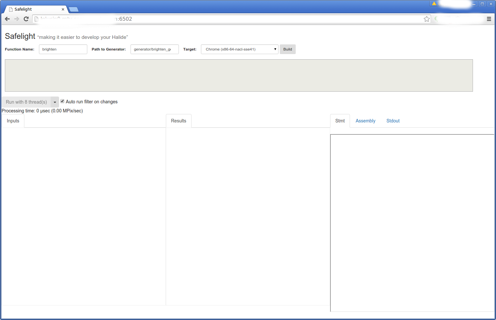
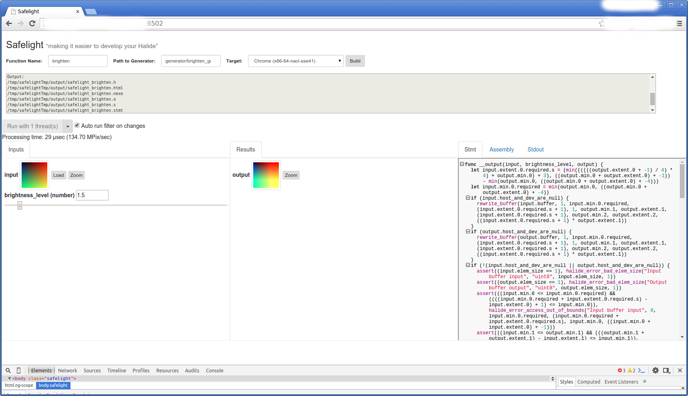

ABOUT SAFELIGHT
================
Safelight is a web application that aids in developing Halide programs.  
It currently works for NaCl-enabled x86-64 Linux and Mac OS machines running the PNaCl
binary distribution of Halide.  
Current features include:

- Ability to build Halide filters given a generator.cpp file.
- UI that displays a filter's Stmt, Assembly, and Stdout.
- UI that displays input parameters and result outputs.
- A display of a run's processing time.
- Control over number of runtime threads.

>This is not an official Google product.


HOW TO SETUP SAFELIGHT
=======================
### Requirements:
- x86_64 Linux or Mac
- [Google Chrome](https://www.google.com/chrome/browser/)
- [NaCl SDK](https://developer.chrome.com/native-client/sdk/download) (Pepper 46 or later)
- [Go](https://golang.org/dl/)
- [PNaCl Halide](https://github.com/halide/Halide/releases)
    - Safelight requires the PNaCl distribution of Halide.
    - If you do not already have a PNaCl binary distribution of Halide, you can run:

            $ ./safelight/getPnaclHalide.sh
            $ source ~/.bashrc
      -  If on Linux, `getPnaclHalide.sh` will download the correct Halide binary distribution, install it within your safelight directory, and export **HALIDE_DIR** to your *.bashrc*.
      -  If on Mac, `getPnaclHalide.sh` will provide you the link to download the correct Halide binary distribution, but you must extract it and point **HALIDE_DIR** to it manually.
    - **Note: Using a non-PNaCl version of Halide (e.g. Trunk) will result in linker errors.**


### Required Environment Variables:
-  Ensure that all of the following environment variables are exported.  Paths must be absolute.
	-  **SAFELIGHT_DIR**=*[path-to-Safelight]/safelight/*
	-  **HALIDE_DIR**=*[path-to-Halide]/halide/*
	    -  If on Linux, `getPnaclHalide.sh` automatically exports HALIDE_DIR to your *.bashrc*.
	-  **NACL_PEPPER_DIR**=*[path-to-NaCl]/nacl_sdk/pepper_[version-number]/*

### Enabling NaCl:
-   Enable Native Client under chrome://flags/#enable-nacl and restart Chrome.

### Running the Server:
```sh
$ ./safelight/serve.sh
```

If all goes well, the console will output the following:

```sh
************************************
Safelight is running on http://<hostname>:6502
************************************
```

Navigate to http://[hostname]:6502 in your Chrome browser.  
  
Enjoy using Safelight!
### Cleaning dependencies and executables:
```sh
$ ./safelight/clean.sh
```

HOW TO USE SAFELIGHT
====================
### Building:
-   In order to build your Halide Program, you must first populate the following
	  text fields:
	1. `"Function Name"`  
		e.g. "brighten" will yield "safelight_brighten.o/h" as your filter output.
	2. `"Path to Generator"` (paths may be absolute or relative to $SAFELIGHT_DIR)  
		e.g. "[path-to-your-generator]/generator/brighten_generator.cpp"  
			or  
		e.g. "generator/brighten_generator.cpp"
	3. `"Target"` (at the moment Safelight only supports
	    x86-64-nacl)
-   After populating each field, click `"Build"`!
	  -	  Outputs Generator's .o, .h, .s, .stmt, and .nexe files.
		You can view the Stmt, Assembly, and Stdout by clicking the tabs on the right-hand side of the page.


### Running Halide Programs:
-   If `"Auto run filter on changes"` is checked, your program should automatically run after it is built and anytime you upload a new image parameter, alter a number parameter, or change the number of threads.
-   If `"Auto run filter on changes"` is not checked, click `"Run with # thread(s)"` to run your program.
-   You may change the number of threads by expanding the `"Run with # thread(s)"` drop down menu and choosing the number of threads to run.

### Example (Try it out!):
-  `"Function Name"`: *brighten*
-  `"Path to Generator"`: *[path-to-safelight]/safelight/generator/brighten_generator.cpp*
-  `"Target"`: *Chrome (x86-64-nacl-sse41)*
-  Click `"Build"` to build the safelight_brighten filter.
    -  A default image parameter and a brightness level range should appear like so:  
    
-  You may upload an image of your own by clicking the `"Load"` button and you may change the brightening factor.
    -  If `"Auto run filter on changes"` is on, the brighten function will run automatically when you upload a new image, change the number of threads, or change the brightening factor.  If you turn it off, click `"Run with # thread(s)"` to run your program.
-  Use the `"Run with # thread(s)"` drop-down menu to select the number of threads to run your program. Notice the change in processing time.  
-  View the Stmt, Assembly, and Stdout of your Halide program.  


TROUBLESHOOTING
===============
If you encounter:  

            Error with command: /tmp/safelightTmp/filters/%s.generator ...

or

            Error with command: g++ ...

You might have downloaded an incompatible Halide binary distribution.  
Run:

            $ ./safelight/getPnaclHalide.sh
            $ source ~/.bashrc

This will download the correct halide binary distribution and point your HALIDE_DIR environment variable to it within your *~/.bashrc*.

If you plan to use an already existing PNaCl Halide version, please double check your required environment variables and ensure they are all pointing to the right directories. Then rerun:

        $ source ~/.bashrc

TESTING SAFELIGHT DEPENDENCIES
==============================
Safelight comes with test packages for C++ visualizers packaged_call_runtime, rgba8_visualizer_generator, and transmogrify_rgba8.  Follow the instructions below to run Google Tests on these dependencies.  

### NaCl Dependency Testing:
Download the two libraries from the links below and point these environment variables to them:

-  [Jsoncpp](https://github.com/open-source-parsers/jsoncpp/tarball/11086dd6a7eba04289944367ca82cea71299ed70)
    -  export  **JSONCPP_DIR**=*[path-to-jsoncpp]*
-  [GTest](https://github.com/google/googletest)
    -  export **GTEST_DIR**=*[path-to-googletest]*

To test packaged_call_runtime, rgba8_visualizer_generator, and transmogrify_rgba8 run:

          $ ./safelight/testSafelight

A Successful Output:

        $ ./testSafelight.sh
        Building gtest...
        ar: creating gtest.a
        ar: creating gtest_main.a
        Building set_image_param_layout.o...
        Building buffer_utils_pepper.o...
        Building nexe_verb_handler.o...
        Building float32_to_rgba8_visualizer_chunky...
        ar: creating /tmp/safelightTmp/librgba8_visualizer.a
        Building float32_to_rgba8_visualizer_planar...
        Building float64_to_rgba8_visualizer_chunky...
        Building float64_to_rgba8_visualizer_planar...
        Building int8_to_rgba8_visualizer_chunky...
        Building int8_to_rgba8_visualizer_planar...
        Building int16_to_rgba8_visualizer_chunky...
        Building int16_to_rgba8_visualizer_planar...
        Building int32_to_rgba8_visualizer_chunky...
        Building int32_to_rgba8_visualizer_planar...
        Building uint8_to_rgba8_visualizer_chunky...
        Building uint8_to_rgba8_visualizer_planar...
        Building uint16_to_rgba8_visualizer_chunky...
        Building uint16_to_rgba8_visualizer_planar...
        Building uint32_to_rgba8_visualizer_chunky...
        Building uint32_to_rgba8_visualizer_planar...
        Building transmogrify_rgba8_to_float32...
        ar: creating /tmp/safelightTmp/libtransmogrify_rgba8.a
        Building transmogrify_rgba8_to_float64...
        Building transmogrify_rgba8_to_int8...
        Building transmogrify_rgba8_to_int16...
        Building transmogrify_rgba8_to_int32...
        Building transmogrify_rgba8_to_uint8...
        Building transmogrify_rgba8_to_uint16...
        Building transmogrify_rgba8_to_uint32...
        Building rgba8_visualizer.o...
        Building transmogrify_rgba8.o...
        >>>>>>>>>> PACKAGE CALL RUNTIME TESTING
        Amalgating header...
        Writing amalgated header to 'dist/json/json.h'
        Amalgating forward header...
        Writing amalgated forward header to 'dist/json/json-forwards.h'
        Amalgating source...
        Writing amalgated source to 'dist/jsoncpp.cpp'
        Source successfully amalagated
        Building jsoncpp.o...
        Building packaged_call_tester...
        Building copy_image_uint8_filter...
        ar: creating /tmp/safelightTmp/libcopy_image.a
        Building copy_image_uint16_filter...
        Building copy_image_float32_filter...
        Building packaged_call_runtime.o...
        Building packaged_call_test executable...
        Running packaged_call_test...
        Running main() from gtest_main.cc
        [==========] Running 2 tests from 1 test case.
        [----------] Global test environment set-up.
        [----------] 2 tests from PackagedCall
        [ RUN      ] PackagedCall.TestDescribe
        [       OK ] PackagedCall.TestDescribe (0 ms)
        [ RUN      ] PackagedCall.TestCall
        [       OK ] PackagedCall.TestCall (1 ms)
        [----------] 2 tests from PackagedCall (1 ms total)
        [----------] Global test environment tear-down
        [==========] 2 tests from 1 test case ran. (1 ms total)
        [  PASSED  ] 2 tests.
        >>>>>>>>>> RGBA8 VISUALIZER TESTING
        Running rgba8_visualizer_generator_test...
        Running main() from gtest_main.cc
        [==========] Running 8 tests from 1 test case.
        [----------] Global test environment set-up.
        [----------] 8 tests from Rgba8VisualizerGeneratorTest
        [ RUN      ] Rgba8VisualizerGeneratorTest.UInt8
        [       OK ] Rgba8VisualizerGeneratorTest.UInt8 (1 ms)
        [ RUN      ] Rgba8VisualizerGeneratorTest.UInt16
        [       OK ] Rgba8VisualizerGeneratorTest.UInt16 (0 ms)
        [ RUN      ] Rgba8VisualizerGeneratorTest.UInt32
        [       OK ] Rgba8VisualizerGeneratorTest.UInt32 (1 ms)
        [ RUN      ] Rgba8VisualizerGeneratorTest.Int8
        [       OK ] Rgba8VisualizerGeneratorTest.Int8 (0 ms)
        [ RUN      ] Rgba8VisualizerGeneratorTest.Int16
        [       OK ] Rgba8VisualizerGeneratorTest.Int16 (0 ms)
        [ RUN      ] Rgba8VisualizerGeneratorTest.Int32
        [       OK ] Rgba8VisualizerGeneratorTest.Int32 (1 ms)
        [ RUN      ] Rgba8VisualizerGeneratorTest.Float32
        [       OK ] Rgba8VisualizerGeneratorTest.Float32 (0 ms)
        [ RUN      ] Rgba8VisualizerGeneratorTest.Float64
        [       OK ] Rgba8VisualizerGeneratorTest.Float64 (0 ms)
        [----------] 8 tests from Rgba8VisualizerGeneratorTest (3 ms total)
        [----------] Global test environment tear-down
        [==========] 8 tests from 1 test case ran. (3 ms total)
        [  PASSED  ] 8 tests.
        >>>>>>>>>> TRANSMOGRIFY TESTING
        Running transmogrify_rgba8_test...
        Running main() from gtest_main.cc
        [==========] Running 8 tests from 1 test case.
        [----------] Global test environment set-up.
        [----------] 8 tests from TransmogrifyRgba8GeneratorTest
        [ RUN      ] TransmogrifyRgba8GeneratorTest.UInt8
        [       OK ] TransmogrifyRgba8GeneratorTest.UInt8 (1483 ms)
        [ RUN      ] TransmogrifyRgba8GeneratorTest.UInt16
        [       OK ] TransmogrifyRgba8GeneratorTest.UInt16 (1931 ms)
        [ RUN      ] TransmogrifyRgba8GeneratorTest.UInt32
        [       OK ] TransmogrifyRgba8GeneratorTest.UInt32 (2068 ms)
        [ RUN      ] TransmogrifyRgba8GeneratorTest.Int8
        [       OK ] TransmogrifyRgba8GeneratorTest.Int8 (1241 ms)
        [ RUN      ] TransmogrifyRgba8GeneratorTest.Int16
        [       OK ] TransmogrifyRgba8GeneratorTest.Int16 (1906 ms)
        [ RUN      ] TransmogrifyRgba8GeneratorTest.Int32
        [       OK ] TransmogrifyRgba8GeneratorTest.Int32 (2031 ms)
        [ RUN      ] TransmogrifyRgba8GeneratorTest.Float32
        [       OK ] TransmogrifyRgba8GeneratorTest.Float32 (2075 ms)
        [ RUN      ] TransmogrifyRgba8GeneratorTest.Float64
        [       OK ] TransmogrifyRgba8GeneratorTest.Float64 (2198 ms)
        [----------] 8 tests from TransmogrifyRgba8GeneratorTest (14933 ms total)
        [----------] Global test environment tear-down
        [==========] 8 tests from 1 test case ran. (14933 ms total)
        [  PASSED  ] 8 tests.

